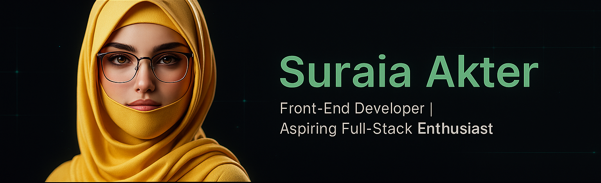

# 💫 About Me:
🎯 I’m currently working on A car rental web app with full-stack features — user authentication, booking system, admin dashboard, and data visualization using Recharts.  🤝 I’m looking to collaborate on Modern React-based projects (especially those involving MongoDB, Firebase, or REST APIs) — and always up for UI improvements or auth flow enhancements.  💛 I’m looking for help with Optimizing protected routes, managing user sessions with JWT/Firebase, and making large-scale components scalable and reusable.  🌿 I’m currently learning React.js, MongoDB, JWT, Firebase Auth, Express.js, and how to architect scalable backend APIs with authentication and database security best practices.  💬 Ask me about React Router (Data API mode), localStorage management, booking flow logic, protected routes, or how I debug API fetch issues like a pro 😄  ⚡ Fun fact I love turning raw JSON into dynamic UI — and I've made booking UIs that show a toast when something is already booked. Efficiency + UX = 💯

## 🌐 Socials:
    

# 💻 Tech Stack:
             
# 📊 GitHub Stats:
 
 

---

<!-- Proudly created with GPRM ( https://gprm.itsvg.in ) -->

<!--
**sura1khan/sura1khan** is a ✨ _special_ ✨ repository because its `README.md` (this file) appears on your GitHub profile.

Here are some ideas to get you started:

- 🔭 I’m currently working on ...
- 🌱 I’m currently learning ...
- 👯 I’m looking to collaborate on ...
- 🤔 I’m looking for help with ...
- 💬 Ask me about ...
- 📫 How to reach me: ...
- 😄 Pronouns: ...
- ⚡ Fun fact: ...
-->
